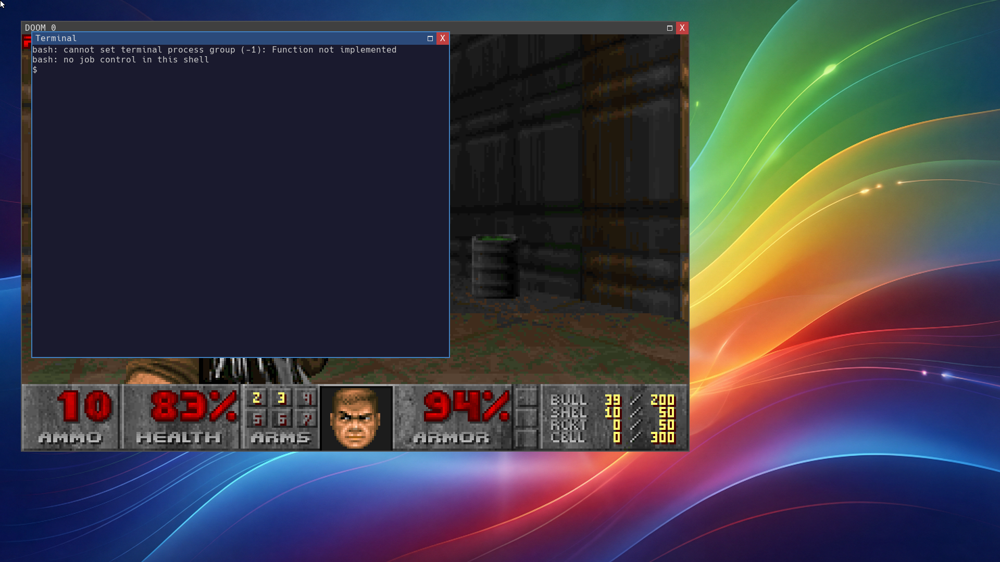
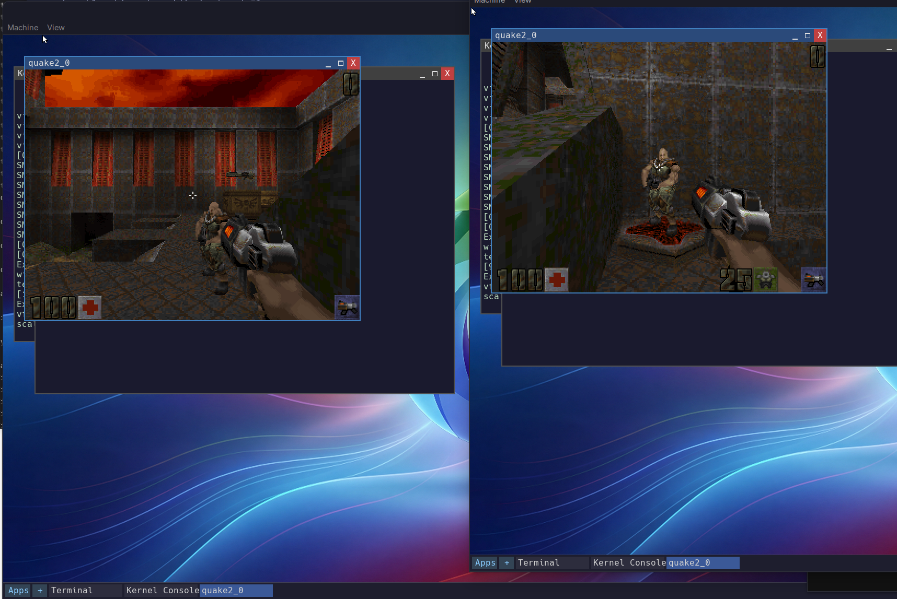

<p align="center">
  
</p>

<h3 align="center">A hobby x86-64 operating system built from scratch</h3>

<p align="center">
  UEFI · C++ · Clang/LLVM · SMP · Window Manager · Runs DOOM
</p>

---

<p align="center">
  
</p>

<p align="center"><em>Brook's compositing window manager running DOOM alongside an interactive bash terminal</em></p>

<p align="center">
  
</p>

<p align="center"><em>Two Brook VMs playing Quake 2 LAN deathmatch over a VDE virtual switch — real UDP sockets, static-IP config, multi-NIC kernel routing</em></p>

## What is Brook?

Brook is a hobby operating system for x86-64, written from scratch in C++ with
a unified Clang/LLVM toolchain. It boots via UEFI, runs on multiple CPU cores,
has a compositing window manager with window chrome, and implements enough of
the Linux syscall ABI to run unmodified Linux binaries — including bash, DOOM,
and a C compiler.

This is my second OS project (the first being
[Enkel](https://github.com/IanNorris/Enkel)). Where Enkel was about getting
things working, Brook is about doing it **right** — clean architecture,
modular drivers, and a codebase that's a pleasure to work in.

## Confirmed Working Software

These run as unmodified Linux ELF binaries on Brook, linked against musl libc:

| Software | Version | Status | Notes |
|----------|---------|--------|-------|
| [bash](https://www.gnu.org/software/bash/) | 5.2 | ✅ Working | Interactive shell with readline, job control, scripting |
| [DOOM](https://github.com/ozkl/doomgeneric) | 1.9 | ✅ Working | Runs in a WM window or full-screen, with keyboard input |
| [busybox](https://busybox.net/) | 1.36 | ✅ Working | ls, cat, echo, wc, head, tail, grep, and many more |
| [TCC](https://bellard.org/tcc/) | 0.9.27 | ✅ Working | Compiles and runs C programs natively on Brook |
| [CoreMark](https://www.eembc.org/coremark/) | 1.0 | ✅ Working | CPU benchmark, runs to completion |
| [musl libc](https://musl.libc.org/) | 1.2 | ✅ Working | Standard C library, dynamically linked |

## Features

### Kernel
- **UEFI bootloader** — custom bootloader loads ELF kernel at high virtual addresses
- **SMP** — symmetric multiprocessing with per-CPU run queues and load balancing
- **MLFQ scheduler** — multi-level feedback queue loaded as a kernel module, with configurable policy
- **Virtual memory** — 4-level paging, per-PID ownership tracking, guard pages, lazy mmap w/ PROT_NONE + on-demand mprotect (needed for Go binaries)
- **Kernel heap** — kmalloc/kfree with slab-style allocation; kmutex, krwlock, ksemaphore
- **Loadable kernel modules** — drivers compiled separately and loaded from disk at boot (Phase 1 from initrd, Phase 2 from /boot/drivers)
- **VFS with FAT and ext2** — virtio-blk backed storage with full read/write support, metadata cache, mount points
- **Panic decoder** — kernel panics render a scannable QR code with a stack-trace payload that Brook's companion `EnkelCrashDecoder` can read

### Networking
- **Multi-interface stack** — up to 4 NICs, per-IF ARP, routing, broadcast handling
- **virtio-net driver** — init/TX/RX with feature negotiation
- **DHCP + static IP** — `NET0_MODE=static` / `NET0_IP` / `NET0_NETMASK` / `NET0_GATEWAY` / `NET0_DNS` in `/boot/BROOK.CFG`
- **TCP/UDP** — BSD sockets (socket, bind, connect, listen, accept, send/recv, setsockopt) with loopback and refcounted close
- **DNS** — resolver wired through the UDP stack
- **VDE pair demo** — two Brook VMs on a virtual switch playing Quake 2 LAN deathmatch

### Audio
- **Intel HDA driver** — codec enumeration, DAC/pin discovery, cyclic DMA output (44.1 kHz / 16-bit stereo)
- **OGG Vorbis decoder** — stb_vorbis-based music playback (Q2 OST streams off disk)

### Package Manager (Nix userspace)
- **Nix store** — `/store` laid out as on a real NixOS system, consumed by the Brook dynamic linker
- **`nix-install` helper** — fetches cached closures from a remote binary cache (HTTPS + HTTP) and unpacks NARs
- **Real Nix binaries** — cowsay, coreutils, curl, bash, etc. run unmodified

### Linux Compatibility
- **~90 syscalls** — open, read, write, mmap (lazy), fork, execve, pipe, dup2, ioctl, poll, epoll, socket/bind/connect, sendto/recvfrom, futex, clock_gettime, rt_sigaction, signalfd, TCGETS2, dirfd, symlinkat and more
- **ELF loader** — loads standard Linux ELF binaries with dynamic linking (musl ld.so)
- **Signals** — full rt_sigaction lifecycle, SIGINT/QUIT/TSTP/CONT/KILL/PIPE/CHLD, signal-safe TTY handling
- **Pipes / fork / exec** — anonymous pipes, full address-space cloning
- **Go runtime** — Go binaries run (lazy PROT_NONE heap, mprotect on demand)

### Window Manager
- **Compositing WM** — desktop wallpaper, window chrome with title bars, z-ordered rendering, drag + resize
- **Terminal emulator** — VT100/ANSI escape sequences (16-colour palette), cell-grid scrollback, wheel-scroll, connected to bash via a pipe pair
- **Mouse + keyboard** — cursor rendering, click-to-focus, wheel events, Ctrl+C/Z/\ signal keys
- **Per-process framebuffers** — each window renders to its own VFB
- **Upscaling** — configurable per-window scale factor (DOOM renders at 4× to fill the screen)

### Userspace / bundled apps
- DOOM (`doomgeneric`), **Quake 2** (SP + LAN multiplayer)
- bash, busybox, TCC, NetSurf (experimental)
- Graphical: mandelbrot, clock, wavplay, sinetest, 2048

### Drivers (loadable modules)
| Module | Description |
|--------|-------------|
| `bochs_display` | BGA/bochs VBE display driver (1920×1080) |
| `ps2_kbd` | PS/2 keyboard — Shift, Ctrl, Alt, CapsLock |
| `ps2_mouse` | PS/2 mouse driver |
| `virtio_blk` | Virtio block device for disk I/O |
| `virtio_input` | Virtio input tablet for absolute mouse positioning |
| `virtio_net` | Virtio-net — TX/RX, multi-queue ready |
| `virtio_rng` | Virtio entropy source |
| `intel_hda` | Intel HDA audio controller (DAC + pin output) |
| `sched_mlfq` | Multi-level feedback queue scheduling policy |

## Building

### Prerequisites

Everything runs inside the pinned Nix shell — no system-level toolchain
is required.  You only need:

- A recent Linux host with `nix` installed (multi-user or single-user)
- QEMU with OVMF (provided via `shell.nix`)

Everything else — clang/lld, NASM, CMake, Ninja, Python + freetype-py,
mtools, e2fsprogs-fuse2fs, vde2, musl cross-compilers, OVMF — is pinned
in `shell.nix`.

```bash
nix-shell
```

### Build

```bash
./scripts/build.sh          # Debug build
./scripts/build.sh Release  # Release build
./scripts/build_all.sh Release  # Kernel + bootloader + Quake 2 + disk images
```

### Run in QEMU

```bash
./scripts/run-qemu.sh --release               # Single VM
./scripts/vde-up.sh up && \
./scripts/run-qemu-pair.sh --release --script wm   # Two VMs on a VDE switch
```

Boot scripts in `data/scripts/` control what runs at startup:

| Script | Description |
|--------|-------------|
| `wm.rc` | Window manager with bash terminal |
| `wmdoom.rc` | Window manager with DOOM + bash terminal |
| `doomfs.rc` | Full-screen DOOM (no WM) |
| `shell.rc` | Direct serial shell (no graphics) |

## Project Structure

```
src/
  bootloader/       UEFI bootloader (PE/COFF, loads kernel ELF)
  kernel/           Kernel (scheduler, VMM, VFS, syscalls, compositor)
  drivers/          Loadable kernel modules (display, input, block, scheduler)
  apps/             Userspace programs (hello, mandelbrot, coremark, ...)
  shared/
    boot_protocol/  Bootloader ↔ kernel handoff structures
    inc_km/         Kernel-mode shared headers
    src_km/         Kernel-mode shared sources
    inc_um/         Usermode shared headers
    src_um/         Usermode shared sources
cmake/
  toolchains/       Clang cross-compilation toolchain files
vendor/
  uefi-headers/     UEFI specification headers (submodule)
scripts/            Build, run, and asset conversion scripts
data/
  scripts/          Boot configuration scripts (.rc files)
docs/
  images/           Screenshots and logo
```

## Acknowledgements

- [DOOM Generic](https://github.com/ozkl/doomgeneric) — portable DOOM engine
- [musl libc](https://musl.libc.org/) — C standard library
- [bash](https://www.gnu.org/software/bash/) — Bourne Again Shell
- [busybox](https://busybox.net/) — Unix utilities in a single binary
- [TCC](https://bellard.org/tcc/) — Tiny C Compiler
- [Hack](https://sourcefoundry.org/hack/) — terminal typeface

## License

MIT — see [LICENSE](LICENSE).
